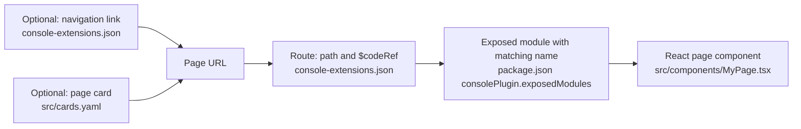

# OpenShift Partner Labs Console Plugin

This dynamic plugin demonstrates three ways a card can act in the OpenShift Console:

| Interaction         | Cards                                                                         | Implementation                                                                                                            |
| ------------------- | ----------------------------------------------------------------------------- | ------------------------------------------------------------------------------------------------------------------------- |
| Open a plugin page  | Custom Page, How-to Use Demos, Creating Virtual Machines, Custom VM Templates | `console-extensions.json`, `src/components/ExamplePage.tsx`, `src/cookbook/`                                              |
| Start a walkthrough | VM Instancetypes & Preferences                                                | `src/components/DemosPage.tsx`, `charts/partner-labs-console-plugin/templates/virt-cookbook/vm-instancetypes-and-preferences.yaml` |
| Trigger a pipeline  | Tekton Pipeline                                                               | `src/components/DemosPage.tsx`                                                                                            |

`src/cards.yaml` is the sparse card registry. Each long cookbook body lives in
`src/cookbook/content/`; `src/data/cards.ts` loads card metadata, and the cookbook
page loads the matching content. The renderer, command runner, and content types
live in `src/cookbook/`. More VM-specific
`ConsoleQuickStart` chart templates for that cookbook belong in
`charts/partner-labs-console-plugin/templates/virt-cookbook/`.

The Custom Page demonstrates `useActiveNamespace`, `k8sListItems`,
`useK8sWatchResource`, `useUserSettings`, `useQuickStartContext`, `ResourceLink`,
and `Timestamp`. It shows copyable `oc` commands for the optional Web Terminal;
the page itself reads resources through the Console SDK and does not execute a shell.

The route `$codeRef` values in `console-extensions.json` must match
`consolePlugin.exposedModules` in `package.json`. Run `yarn i18n` after changing
translated strings.

## Create a plugin page



Create the component, expose it under a name such as `MyPage`, and use that name
as the route's `$codeRef`. The route's `path` is the URL to open. To make the page
discoverable, add a navigation link or a `kind: page` card whose URL matches that
path. `ExamplePage` at `/partner-labs-example` is the existing example.

This repository can be used as a template. Use GitHub's **Use this template**
action, then update plugin metadata, the i18n namespace, route paths, CSS
prefix, and Helm values.

## Requirements

- OpenShift Console 4.19 or newer. This build uses the 4.19 Console plugin SDK
  and PatternFly 6. It supports the 4.19–4.21 compatibility router and the
  4.22+ router bridge.
  Console 4.22 changed its shared React, router, and i18n versions, so validate
  the plugin on each Console release you deploy to.
- Node.js 24 and Yarn 4 for building the plugin. Use the version in `.nvmrc`
  for local development; the Docker image, CI, and devcontainer also use Node.js 24.
- An OpenShift cluster and `oc` login for running it in the console.
- OpenShift Pipelines for the Tekton card. The user needs permission to create
  `PipelineRun` resources in the active namespace. The cluster must be able to
  pull `registry.access.redhat.com/ubi9/ubi-minimal:latest`.

The walkthrough card requires the `ConsoleQuickStart` resource installed by the
Helm chart. Running only the local plugin server does not install that resource.

## Develop

```sh
yarn install
yarn start
```

After `oc login`, run `yarn start-console` in another terminal and open
<http://localhost:9000/partner-labs-demos>.

Run checks with `yarn test`, `yarn lint`, and `yarn build`.

The Playwright test installs the Helm chart on the target cluster, then removes
the release and its namespace. Set `PLUGIN_TEMPLATE_PULL_SPEC` to a pullable
plugin image before running `yarn test-e2e-headless`.

## Deploy

Build and push the image, then install the Helm chart:

```sh
docker build -t quay.io/my-repository/partner-labs-console-plugin:latest .
docker push quay.io/my-repository/partner-labs-console-plugin:latest
helm upgrade -i partner-labs-console-plugin charts/partner-labs-console-plugin \
  -n partner-labs-console-plugin --create-namespace \
  --set plugin.image=quay.io/my-repository/partner-labs-console-plugin:latest
```

On Apple Silicon, build an amd64 image for amd64 OpenShift nodes with
`podman build --platform linux/amd64 -t quay.io/my-repository/partner-labs-console-plugin:v2 .`.
The Node build stage runs natively; the final nginx stage uses the requested
platform. Push the new tag and set `plugin.image` to that tag in the Helm upgrade.

Set `plugin.quickStarts.instancetypePreference.enabled=false` to omit the
walkthrough resource.
